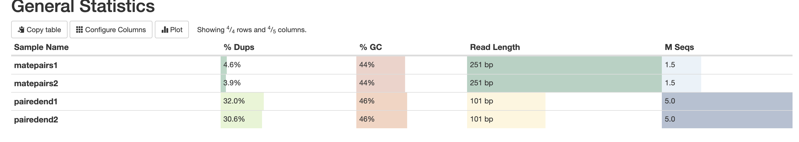
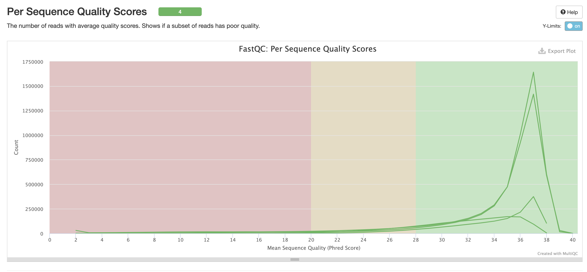
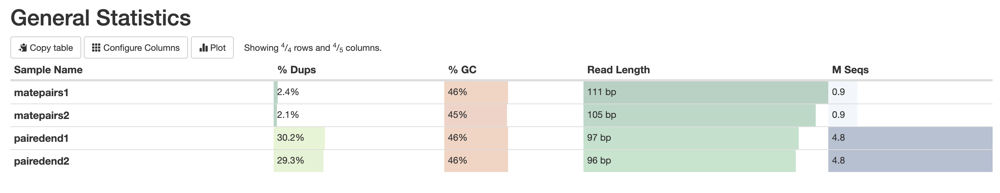

Антон Андрущенко, БПМИ202 (группа 1 на майноре)

**Команды выполненные на сервере**

***Создание ссылок***
```
ln -s /usr/share/data-minor-bioinf/assembly/oil_R1.fastq
ln -s /usr/share/data-minor-bioinf/assembly/oil_R2.fastq
ln -s /usr/share/data-minor-bioinf/assembly/oilMP_S4_L001_R1_001.fastq
ln -s /usr/share/data-minor-bioinf/assembly/oilMP_S4_L001_R2_001.fastq
```

***Создание случайных чтений***
```
seqtk sample -s719 oil_R1.fastq 5000000 > pairedend1.fastq
seqtk sample -s719 oil_R2.fastq 5000000 > pairedend2.fastq
seqtk sample -s719 oilMP_S4_L001_R1_001.fastq 1500000 > matepairs1.fastq
seqtk sample -s719 oilMP_S4_L001_R2_001.fastq 1500000 > matepairs2.fastq
```

***Оценка с помощью FastQC***
```
mkdir fastqc
fastqc -o fastqc pairedend1.fastq pairedend2.fastq matepairs1.fastq matepairs2.fastq
```

***Оценка с помощью MultiQC***
```
mkdir multiqc
multiqc -o multiqc fastqc
```

***Отчеты***





***Обрезание чтений с помощью platanus_trim***
```
platanus_trim pairedend1.fastq pairedend2.fastq
platanus_internal_trim matepairs1.fastq matepairs2.fastq
rm pairedend1.fastq pairedend2.fastq matepairs1.fastq matepairs2.fastq
```

***Оценка обрезанных чтений с помощью FastQC***
```
mkdir fastqc
fastqc -o fastqc pairedend1.fastq.trimmed pairedend2.fastq.trimmed matepairs1.fastq.int_trimmed matepairs2.fastq.int_trimmed
```

***Оценка обрезанных чтений с помощью MultiQC***
```
mkdir multiqc
multiqc -o multiqc fastqc
```

***Отчеты***




***Сбор контиг***
```
platanus assemble -o Poil -f pairedend1.fastq.trimmed pairedend2.fastq.trimmed
```

***Сбор скаффолдов***
```
platanus scaffold -o Poil -c Poil_contig.fa -IP1 pairedend1.fastq.trimmed pairedend2.fastq.trimmed -OP2 matepairs1.fastq.int_trimmed matepairs2.fastq.int_trimmed
```

***Уменьшение числа промежутков***
```
platanus gap_close -o Poil -c Poil_scaffold.fa -IP1 pairedend1.fastq.trimmed pairedend2.fastq.trimmed -OP2 matepairs1.fastq.int_trimmed matepairs2.fastq.int_trimmed
rm pairedend1.fastq.trimmed pairedend2.fastq.trimmed matepairs1.fastq.int_trimmed matepairs2.fastq.int_trimmed
```

**Ссылка на Jupyter Notebook**

[вот она](src/analyze.ipynb)
